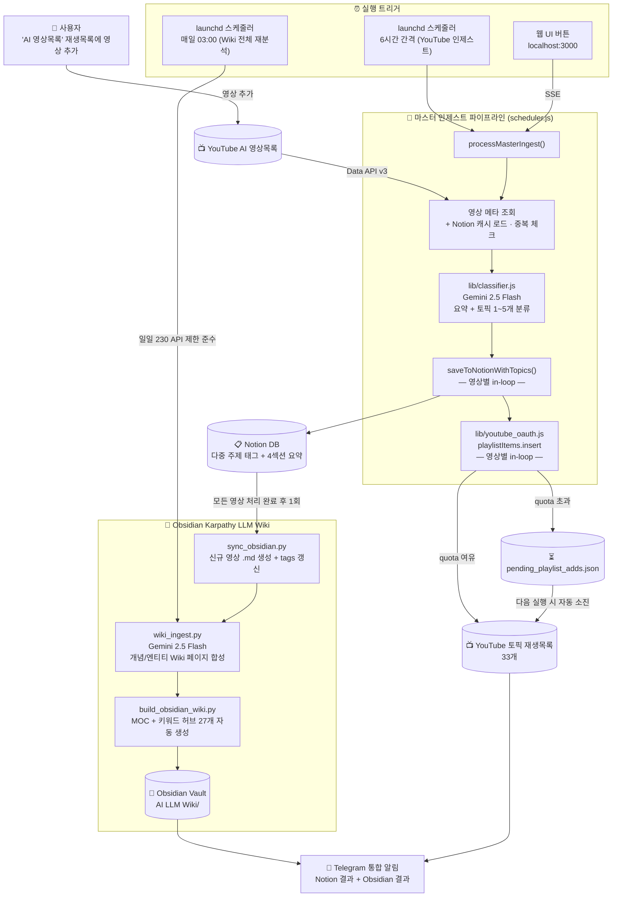

# 🎬 YouTube → Notion AI 요약기 + Obsidian LLM Wiki

YouTube 재생목록의 영상을 **Gemini AI**로 자동 요약하여 **Notion DB**에 저장하고,  
**Obsidian**으로 자동 동기화하여 **LLM Wiki** 지식베이스를 구축하는 풀스택 자동화 솔루션입니다.

---

## 🚀 프로젝트 개요
본 프로젝트는 AI 에이전트 기술을 활용하여 구현 및 고도화되었습니다.
* **AI Assistant**: Claude (Anthropic) — Agentic Coding
* **AI Model**: **Gemini 2.5 Flash** — YouTube 영상 요약 및 분류 엔진
* **Coding Style**: **Vibe Coding** (AI-driven iterative design & implementation)

---

## ✨ 주요 기능

- 🎥 **YouTube 재생목록 자동 수집** — YouTube Data API v3로 재생목록 영상 전체 조회
- 🤖 **Gemini AI 자동 요약** — 영상 제목·설명·태그 기반 4섹션 보고서 자동 생성
- 📝 **Notion DB 자동 저장** — 요약 결과를 Notion 데이터베이스에 구조화하여 저장
- 🔄 **스마트 중복 방지** — Notion 전체 캐시 로드 후 메모리에서 즉시 중복 체크
- 📊 **통계 자동 업데이트** — 조회수·구독자수 15% 이상 변화 시만 Notion API 호출
- 📓 **Obsidian 자동 동기화** — 신규 저장 완료 시 Obsidian LLM Wiki 자동 업데이트
- 🔗 **Wiki 링크 자동 구성** — 재생목록별 MOC, 채널별 목차, 키워드 링크 자동 생성
- 📱 **텔레그램 알림** — 노션 저장 결과 + Obsidian 동기화 결과 통합 전송
- ⏰ **launchd 자동 스케줄링** — Mac 로그인 시 서버 자동 시작, 6시간 간격 스케줄러 실행

---

## 🏗️ 시스템 아키텍처



---

## 📂 프로젝트 구조

```
Youtube_Notion_Grap/
├── server.js                          # 웹 서버 + Notion API 프록시 + Obsidian 트리거
├── scheduler.js                       # 자동 스케줄러 (6시간 간격, 마스터 인제스트 포함)
├── index.html                         # 웹 앱 UI (단일 파일)
├── package.json                       # Node.js CommonJS 설정
├── playlists.json                     # 등록된 재생목록 목록
├── .env                               # API 키 (gitignore — 절대 커밋 금지)
├── favicon.svg                        # 브라우저 탭 아이콘
├── migrate_classify.js                # 기존 영상 일괄 재분류 스크립트 (v102)
├── oauth_setup.js                     # YouTube OAuth refresh_token 1회 발급 도구 (v102)
├── notion_to_obsidian.js              # Notion → Obsidian 일회성 마이그레이션
├── sync_obsidian.py                   # Obsidian 증분 동기화 (신규 영상 추가 및 위키 인제스트 연동)
├── wiki_ingest.py                     # Gemini 기반 엔티티/개념 위키 페이지 합성 스크립트 (v111)
├── wiki_config.py                     # Wiki Ingest 공통 설정 및 API 호출 유틸 (v111)
├── build_obsidian_wiki.py             # MOC + 채널 목차 + 키워드 링크 빌더
├── cleanup_duplicates.py              # 노션/Obsidian 중복 정리 도구
├── com.irichgreen.server.plist        # launchd 서버 자동시작 설정
├── com.irichgreen.ytsummarizer.plist  # launchd 스케줄러 설정
├── com.irichgreen.wiki-ingest.plist   # launchd 일일 Wiki 인제스트 스케줄러 (v111)
├── install-server.sh                  # 서버 자동시작 설치 스크립트
├── install-scheduler.sh               # 스케줄러 설치 스크립트
├── install-wiki-ingest.sh             # 일일 Wiki 인제스트 스케줄러 설치 스크립트 (v111)
├── lib/
│   ├── youtube_oauth.js               # YouTube OAuth 2.0 + playlistItems.insert (v102)
│   └── classifier.js                  # Gemini 기반 토픽 분류기 (v102)
└── README.md
```

---

## 🛠️ 기술 스택

| 분류 | 기술 |
|------|------|
| **Runtime** | Node.js v25+, Python 3 |
| **Backend** | Node.js HTTP 서버 (Notion API 프록시) |
| **Frontend** | Vanilla HTML/CSS/JavaScript (Single File) |
| **AI 요약** | Google Gemini 2.5 Flash API |
| **데이터 소스** | YouTube Data API v3 |
| **저장소** | Notion Database API |
| **Wiki** | Obsidian (로컬 마크다운 지식베이스) |
| **알림** | Telegram Bot API, Gmail SMTP |
| **스케줄링** | macOS launchd |

---

## 🔑 환경 변수 설정 (.env)

프로젝트 루트에 `.env` 파일을 생성하세요. (GitHub에 절대 올리지 않습니다)

```env
YOUTUBE_API_KEY=AIzaSy...
GEMINI_API_KEY=AIzaSy...
NOTION_TOKEN=ntn_...
NOTION_DB_ID=xxxxxxxxxxxxxxxxxxxxxxxxxxxxxxxx

TELEGRAM_ENABLED=true
TELEGRAM_BOT_TOKEN=1234567890:AAG...
TELEGRAM_CHAT_ID=1234567890

EMAIL_ENABLED=false
EMAIL_FROM=your@gmail.com
EMAIL_TO=recipient@email.com
EMAIL_APP_PASS=xxxx xxxx xxxx xxxx

# YouTube OAuth 2.0 (v102 — 토픽 재생목록 자동 추가용)
# oauth_setup.js 실행 후 자동 기입됩니다
YOUTUBE_OAUTH_CLIENT_ID=...
YOUTUBE_OAUTH_CLIENT_SECRET=...
YOUTUBE_OAUTH_REFRESH_TOKEN=...
YOUTUBE_MASTER_PLAYLIST_ID=PLxxxxxxxxxxxxxxxxxxxxxxxx
```

---

## 📦 설치 및 실행

### 1. 사전 요구사항
- Node.js v18 이상, Python 3
- YouTube Data API v3 키
- Google Gemini API 키
- Notion Integration 토큰 + 데이터베이스 ID

### 2. 서버 및 스케줄러 실행
```bash
# 서버 수동 실행
node server.js

# Mac 자동 시작 등록
bash install-server.sh
bash install-scheduler.sh
```

---

## 📓 Obsidian LLM Wiki

노션에 저장된 AI 영상 요약을 Obsidian 지식베이스로 자동 변환하며, `wiki_ingest.py`를 통해 지식 간의 관계를 분석하여 위키 페이지를 합성합니다. 자세한 구조는 [CLAUDE.md](CLAUDE.md)를 참조하세요.

---

## 📊 Notion DB 컬럼 구조

| 컬럼명 | 타입 | 설명 |
|--------|------|------|
| 영상 제목 | Title | YouTube 영상 제목 |
| 요약 내용 | Rich Text | Gemini AI 생성 4섹션 보고서 |
| 유튜브 채널 | Rich Text | 채널명 |
| 업로드 일자 | Date | 실제 영상 업로드 날짜 |
| 조회수 | Number | 최신 조회수 |
| 구독자수 | Number | 채널 구독자수 |
| 영상 URL | URL | YouTube 영상 링크 |
| 썸네일 URL | URL | 영상 썸네일 이미지 |
| 처리 상태 | Select | 완료 / 오류 |
| 주제 | Multi-Select | 재생목록명 (NFC 정규화 적용) |

---

## 🔄 버전 관리 (Version History)

본 프로젝트는 **`v[Major].[Minor]`** 형식의 단순화된 버전 규칙을 따릅니다.
- **Major**: 핵심 엔진 교체, 아키텍처 개편 등 대규모 변화
- **Minor**: 기능 개선, 버그 수정, 프롬프트 튜닝 등 마이너한 변화

### 📌 요약 이력 (Summary Table)

| 버전 | 날짜 | 주요 내용 요약 |
| :-- | :--- | :--- |
| **v2.0** | 2026-05-16 | **할당량 최적화 및 안정성 강화**: 배치 크기 하향 및 순차 처리 도입 |
| **v1.2** | 2026-05-12 | **Karpathy LLM Wiki & 비용 최적화**: Wiki Ingest 구현 및 비용 85% 절감 |
| **v1.1** | 2026-05-02 | **개발 환경 및 분류 지능화**: CLAUDE.md 도입 및 바이브코딩 매핑 강화 |
| **v1.0** | 2026-04-10 | 프로젝트 초기화 및 핵심 파이프라인 구축 단계 |

---

### 📝 상세 변경 내역 (Detailed Change Log)

#### [v2.0] — 2026-05-16
- **할당량 최적화**: `scheduler.js`의 `MAX_NEW_PER_RUN`을 15개로 하향 조정하여 Gemini API 할당량 대응.
- **순차 처리 도입**: 병렬 처리를 순차 처리로 변경하여 안정적인 API 호출 확보.
- **지연 시간 추가**: 요청 사이에 2초의 지용 시간(setTimeout)을 추가하여 Rate Limit 방지.
- **아키텍처 시각화**: Mermaid 다이어그램 도입으로 전체 시스템 데이터 흐름 가시화.

#### [v1.2] — 2026-05-12
- **Karpathy Wiki 파이프라인**: `wiki_ingest.py`를 통해 Obsidian 문서를 분석하여 Wiki 페이지 자동 합성 기능 구현.
- **비용 최적화 (핵심)**: Gemini API 호출부에 `thinkingBudget: 0` 설정을 적용하여 토큰 비용 약 85% 절감.
- **자동 스케줄링**: `launchd`를 통해 매일 03:00에 Wiki 인제스트 자동 실행 설정.

#### [v1.1] — 2026-05-02
- **개발 환경 정비**: `CLAUDE.md` 도입 및 Claude Code 환경 최적화.
- **분류 지능화**: AI 코딩 콘텐츠를 "AI 바이브코딩"으로 매핑 강화하여 분류 정확도 향상.
- **웹 UI 고도화**: 마스터 인제스트 모드 실시간 처리 결과 테이블 연동.

#### [v1.0] — 2026-04-10
- **프로젝트 초기화**: YouTube -> Notion -> Obsidian 기본 파이프라인 구축.
- **NFC 정규화**: Notion 태그 한글 깨짐 방지를 위한 NFC 정규화 전수 적용.
- **마스터 인제스트**: "AI 영상목록" 하나로 자동 분류 및 배분 시스템 구축.

---

© 2026 iRichGreen AI Development Team.  
Powered by **Claude (Anthropic)** & **Gemini 2.5 Flash (Google)**
