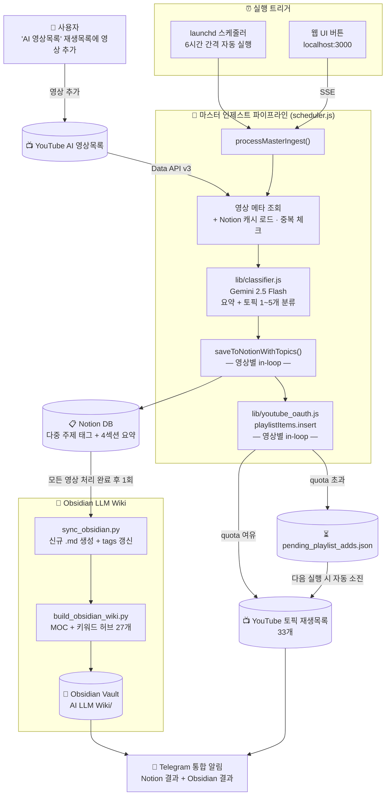

# 🎬 YouTube → Notion AI 요약기 + Obsidian LLM Wiki

YouTube 재생목록의 영상을 **Gemini AI**로 자동 요약하여 **Notion DB**에 저장하고,  
**Obsidian**으로 자동 동기화하여 **LLM Wiki** 지식베이스를 구축하는 풀스택 자동화 솔루션입니다.

---

## 🆕 최근 주요 변경사항 (v110)

### v110 — README 데이터 흐름 mermaid 다이어그램 도입 (2026-05-07)

**변경 내용**: "전체 파이프라인" + "아키텍처" 두 ASCII 다이어그램을 GitHub 자동 렌더링되는 mermaid `flowchart TD` 하나로 통합.
외부 서비스(YouTube Data API / OAuth, Gemini, Notion, Telegram)와 로컬 산출물(Obsidian Vault) 간 관계를 subgraph로 시각화하여 처음 보는 사람도 데이터 흐름을 한눈에 파악할 수 있도록 개선.

---

## 🆕 최근 주요 변경사항 (v109)

### v109 — pending 큐 자동 소진 + 재분류 도구 개선 (2026-05-05)

**문제**: `pending_playlist_adds.json`에 YouTube 재생목록 미처리 항목 671건이 쌓여 있었으나, 스케줄러가 큐를 읽는 로직이 없어 영구히 방치됨.

**수정**:
- [`scheduler.js`](scheduler.js): `flushPendingQueue()` 함수 추가. 매 실행 시 Notion 캐시 로드 직후, quota 여유분 내에서 pending 큐를 자동 소진. OAuth 토큰 만료 시 즉시 중단 메시지 출력 후 큐 보존.
- [`scheduler.js`](scheduler.js): `droppedTopics` 로깅 추가 — Gemini가 반환한 토픽이 `allowedSet` 불일치로 조용히 탈락하는 케이스를 로그로 노출.
- [`migrate_classify.js`](migrate_classify.js): `--video-id=VIDEO_ID` 옵션 추가 — 특정 영상 1건만 재분류·재적재 가능.

**영상 수동 재분류**: `0SGfDKMLdaI` ("비개발자 바이브코더가 가장 두려워하는 단어 '백엔드'") — Notion 주제 `[]` → `["AI 바이브코딩"]` 완료.

---

### v108 — CLAUDE.md 도입 + Claude Code 개발환경 세팅 (2026-05-02)

**변경 요약**: Claude Code (VS Code 확장) 기반 개발환경 전환에 따른 프로젝트 문서화 및 설정 정비.

**신규 파일**:
- [`CLAUDE.md`](CLAUDE.md): Claude Code용 프로젝트 컨텍스트 문서. 주요 명령어, 아키텍처 개요, 핵심 파일 역할, NFC 정규화·Notion 블록 한계·YouTube quota 등 중요 제약사항 수록.

**수정 파일**:
- [`.claude/settings.local.json`](.claude/settings.local.json): 세션별 일회성 허용 43개 → 패턴 기반 13개로 통합 정리 (PID 하드코딩, 특정 PR 제목 등 제거).
- [`.gitignore`](.gitignore): `.migrate_state.json`, `.quota_state.json`, `migration_preview.csv` 추가.

**글로벌 설정** (저장소 외부):
- `~/.claude/CLAUDE.md`: Andrej Karpathy의 LLM 코딩 지침 4원칙 추가 — Think Before Coding, Simplicity First, Surgical Changes, Goal-Driven Execution.

---

### v107 — 분류기 프롬프트: AI 코딩/개발 콘텐츠 → AI 바이브코딩 매핑 추가 (2026-05-02)
**문제**: "AI한테 코드 맡기면 점점 이상해지는 진짜 이유" (채널: 메이커 에반) — DDD·TDD·기술부채 등 AI 코딩 실천론 영상이 주제 빈 배열로 분류됨.

**원인**: `playlists.json`의 33개 토픽 중 "AI 코딩 품질 관리" 내용을 커버하는 항목 없음(토픽 커버리지 갭). Gemini가 반환한 후보 토픽이 `allowedSet`에 없어 `lib/classifier.js:159` 필터에서 전부 탈락 → `topics: []`.

**수정** — [`lib/classifier.js`](lib/classifier.js):
- 제목 우선 신호에 "AI 코딩/AI 개발 관련 내용(코드 품질, DDD, TDD, 기술부채, AI로 코드 작성 실천론) → AI 바이브코딩" 예시 추가
- 누락 영상 수동 재분류: Notion 주제 `[]` → `["AI 바이브코딩"]`, YouTube pending 큐에 추가

---

### v103 — 마스터 인제스트 결과 메시지 상세화 + 진행률 UI + Obsidian 자동 tags 동기화 (2026-04-27)
**변경 요약**: ① 텔레그램 메시지에 주제별 분류 건수 표시 (영상 목록 제거). ② 웹 UI 완료 시 진행 바 100%/"완료" 표시 (0% 멈춤 버그 수정). ③ YouTube quota 초과 시 `pending_playlist_adds.json` 자동 적재 → 다음날 cron 처리. ④ `AI 영상목록`을 주제 태그에서 제거 (재생목록명, 분류 아님). ⑤ `sync_obsidian.py` 기존 파일 tags 자동 동기화 — 매 실행마다 Notion 현재 주제와 Obsidian frontmatter `tags:` 자동 비교·갱신.

**수정 파일**: `lib/classifier.js`, `scheduler.js`, `server.js`, `index.html`, `sync_obsidian.py`

### v104 — 분류기 프롬프트 개선: 대상 독자 신호 + 채널명 신호 (2026-04-27)
**문제**: "비개발자 바이브코더를 위해 만든, 가볍게 들어도 깊게 남는 프론트엔드 기본 지식" (채널: 양실장의 바이브코딩대학)이 주제 빈 배열로 분류됨.

**원인**: `classifier.js`의 "제목 우선 신호"가 "바이브 코딩으로 X를 했다" 패턴(행위)만 인식. **"바이브코더를 위해/위한 X"** 처럼 대상 독자(target audience)로 명시된 경우, 채널명에 특정 도구/주제가 들어간 경우를 무시.

**수정** — [`lib/classifier.js`](lib/classifier.js):
- 제목 우선 신호 확장: "바이브코더를 위해/위한 X" → "AI 바이브코딩" 포함
- **채널 신호 추가**: 채널명에 "바이브코딩" 포함 + 코딩·개발 관련 내용 → "AI 바이브코딩" 포함. 기타 AI 도구명 포함 채널도 동일 적용.
- Notion에서 해당 영상 수동 재분류 완료: `[]` → `["AI 바이브코딩"]`

---

### v102 — AI 영상목록 마스터 인제스트 (2026-04-25)
**목표**: 사용자가 영상을 분류 없이 "AI 영상목록" 하나에만 넣으면 자동으로 분류 → 저장 → 재생목록 추가까지 처리.

**새로운 워크플로**:
```
"AI 영상목록"에 영상 추가
       ↓
 Gemini AI 요약 + 토픽 자동 분류 (0~5개)
       ↓
 Notion DB 저장 (다중 주제 태그)
       ↓
 YouTube 토픽 재생목록에 자동 추가 (OAuth)
```

**신규 파일**:
- [`lib/youtube_oauth.js`](lib/youtube_oauth.js): YouTube OAuth 2.0 + `playlistItems.insert` API (access_token 캐시, 일일 quota 추적, rate limit)
- [`lib/classifier.js`](lib/classifier.js): Gemini 기반 토픽 분류기 (상한 5개, 추상 토픽 과추천 방지, 제목 우선 신호, NFC 정규화)
- [`migrate_classify.js`](migrate_classify.js): 기존 1,518개 영상 일괄 재분류 스크립트 (`--dry-run` / `--notion-only` / `--youtube-only` / `--apply` 모드, state file 기반 재개)
- [`oauth_setup.js`](oauth_setup.js): YouTube OAuth 2.0 refresh_token 1회 발급 도구 (PKCE + 로컬 콜백 서버)

**수정**:
- [`scheduler.js`](scheduler.js): `processMasterIngest()` + `saveToNotionWithTopics()` 추가. `YOUTUBE_MASTER_PLAYLIST_ID` 설정 시 자동으로 마스터 모드 진입 (`--legacy` 플래그로 기존 33개 재생목록 모드 유지)
- [`server.js`](server.js): `/api/master-ingest` SSE 엔드포인트 추가 (scheduler 실시간 스트리밍)
- [`index.html`](index.html): "🆕 AI 영상목록 처리" 버튼 + `startMasterIngest()` 함수 추가

**환경 변수 추가** (`.env`):
```env
YOUTUBE_OAUTH_CLIENT_ID=...
YOUTUBE_OAUTH_CLIENT_SECRET=...
YOUTUBE_OAUTH_REFRESH_TOKEN=...
YOUTUBE_MASTER_PLAYLIST_ID=PLnDn1H0jzj2g...
```

**사용법**:
```bash
# 웹 UI → "🆕 AI 영상목록 처리" 버튼 클릭 (SSE 실시간 로그)
# 또는 스케줄러 자동 실행 (6시간 주기, 마스터 모드 우선)
node scheduler.js              # 마스터 인제스트 모드
node scheduler.js --legacy     # 레거시 33개 재생목록 모드

# 기존 영상 일괄 마이그레이션
node migrate_classify.js --dry-run --limit=20      # 미리보기
node migrate_classify.js --notion-only             # Notion 태그만 보완 (1회성)
node migrate_classify.js --youtube-only --resume   # YouTube 추가 (매일 분할)
```

---

## 🆕 이전 주요 변경사항 (v97 ~ v101)

### v100 — Obsidian 그래프 독립 노드 본격 해소 (2026-04-24)
**문제**: v98에서 영상 하단에 `[[Claude]]`, `[[Claude Code]]` 등 키워드 링크를 추가했으나 해당 이름의 실제 파일이 없어 **미해결(unresolved) 링크**로 남았습니다. Obsidian 그래프뷰에서 미해결 링크는 엣지를 약하게 표시하거나 숨기기 때문에, 영상 노드들이 MOC 하나에만 연결된 위성 클러스터처럼 보여 "독립 노드"로 인식되었습니다.

**해결**: [build_obsidian_wiki.py](build_obsidian_wiki.py)에 `build_keyword_hubs()` 함수 추가.
- `_MOC/Claude.md`, `_MOC/Claude Code.md`, `_MOC/Gemini.md` 등 **키워드별 허브 파일 27개 자동 생성**
- 각 허브는 해당 키워드를 언급한 영상 목록(최신순, 채널명, 업로드 날짜 포함)을 담음
- `[[Claude]]` 링크가 실제 파일로 해결 → 같은 키워드 언급 영상끼리 허브를 통해 그래프 엣지로 연결
- 1,970개 영상 파일에서 미해결 링크가 해결되어 그래프 클러스터 밀도 대폭 개선

### v99 — 조회수/구독자수 업데이트 임계값 완화 (2026-04-24)
**문제**: v98에서 20% 임계값을 걸었으나 2,313개 영상 중 업데이트 0건. 실사용 변화율을 확인한 결과 대부분 2~10% 구간 (예: 7,531 → 8,168 = 8.5%)에 있어 20%는 과도한 필터였습니다.

**해결**: 임계값 **20% → 15%**로 완화.
- [scheduler.js:584,591](scheduler.js:584): `>= 0.2` → `>= 0.15`
- [index.html:1379,1386](index.html:1379): `>= 0.2` → `>= 0.15` (웹 UI 동일 적용)
- `savedView`가 `null`/`0`이면 최초 채움, 그 외에는 15% 이상 변화 시만 업데이트

### v98 — Obsidian 그래프 1차 해소 + 통계 미업데이트 버그 수정
**Obsidian**: [build_obsidian_wiki.py](build_obsidian_wiki.py)의 `add_keyword_links()`에 본문 매칭 키워드를 "관련 항목" 섹션에 추가. 본문 치환 없이 하단 섹션에만 링크 삽입 (v93의 빈 파일 버그 재발 방지).

**통계 버그**: `savedView`가 `null`이거나 `0`일 때 임계값 검사가 `NaN` 또는 분모 0 문제를 일으켜 업데이트가 스킵되던 버그 수정. 최초 저장 영상도 정상적으로 채워지도록 로직 개선.

### v97 — 웹 UI 중복 방지 강화 3종 세트
1. **[index.html](index.html) `loadNotionCache` 재시도 로직 이식**
   - 기존: 스케줄러 경로에만 있던 재시도 로직
   - 변경: 웹 UI에도 동일 재시도(3회, 2초 간격) 적용
   - 효과: 부분 캐시 로딩으로 인한 Notion 중복 저장 차단

2. **[server.js](server.js) `ALLOWED_NOTION_PATHS`에 `/v1/blocks/{id}/children` 추가**
   - 기존: 100블록 초과 긴 요약이 차단됨
   - 변경: blocks append 엔드포인트를 화이트리스트에 추가
   - 효과: 긴 요약(100블록 초과) 정상 저장 가능

3. **웹 UI 텔레그램 2중 전송 → 1회 통합**
   - 기존: Notion 결과 1통 + Obsidian 결과 1통 → 2회 전송
   - 변경: [server.js](server.js) `/api/sync-obsidian`이 `notionMsg` body를 받아 `Notion + 구분선 + Obsidian` 단일 메시지로 통합 전송
   - 효과: 스케줄러 경로(v95)와 동일 동작으로 통일

---

## ⚡ Vibe Coding with AI

본 프로젝트는 AI 에이전트 기술을 활용하여 구현 및 고도화되었습니다.

- **AI Assistant**: [Claude](https://claude.ai) (Anthropic) — Agentic Coding
- **AI Model**: **Gemini 2.5 Flash** — YouTube 영상 요약 엔진
- **Coding Style**: **Vibe Coding** (AI-driven iterative design & implementation)

---

## ✨ 주요 기능

- 🎥 **YouTube 재생목록 자동 수집** — YouTube Data API v3로 재생목록 영상 전체 조회
- 🤖 **Gemini AI 자동 요약** — 영상 제목·설명·태그 기반 4섹션 보고서 자동 생성
- 📝 **Notion DB 자동 저장** — 요약 결과를 Notion 데이터베이스에 구조화하여 저장
- 🔄 **스마트 중복 방지** — Notion 전체 캐시 로드 후 메모리에서 즉시 중복 체크
- 📊 **통계 자동 업데이트** — 조회수·구독자수 15% 이상 변화 시만 Notion API 호출
- 📓 **Obsidian 자동 동기화** — 신규 저장 완료 시 Obsidian LLM Wiki 자동 업데이트
- 🔗 **Wiki 링크 자동 구성** — 재생목록별 MOC, 채널별 목차, 키워드 링크 자동 생성
- 📱 **텔레그램 알림** — 노션 저장 결과 + Obsidian 동기화 결과 통합 전송
- 📧 **이메일 알림** — Gmail SMTP를 통한 이메일 알림 (선택)
- ⏰ **launchd 자동 스케줄링** — Mac 로그인 시 서버 자동 시작, 6시간 간격 스케줄러 실행


---

## 🏗️ 전체 파이프라인




---

## 🛠️ 기술 스택

| 분류 | 기술 |
|------|------|
| **Runtime** | Node.js v25+, Python 3 |
| **Backend** | Node.js HTTP 서버 (Notion API 프록시) |
| **Frontend** | Vanilla HTML/CSS/JavaScript (Single File) |
| **AI 요약** | Google Gemini 2.5 Flash API |
| **데이터 소스** | YouTube Data API v3 |
| **저장소** | Notion Database API |
| **Wiki** | Obsidian (로컬 마크다운 지식베이스) |
| **알림** | Telegram Bot API, Gmail SMTP |
| **스케줄링** | macOS launchd |

---

## 📁 파일 구조

```
Youtube_Notion_Grap/
├── server.js                          # 웹 서버 + Notion API 프록시 + Obsidian 트리거
├── scheduler.js                       # 자동 스케줄러 (6시간 간격, 마스터 인제스트 포함)
├── index.html                         # 웹 앱 UI (단일 파일)
├── package.json                       # Node.js CommonJS 설정
├── playlists.json                     # 등록된 재생목록 목록
├── .env                               # API 키 (gitignore — 절대 커밋 금지)
├── favicon.svg                        # 브라우저 탭 아이콘
├── migrate_classify.js                # 기존 영상 일괄 재분류 스크립트 (v102)
├── oauth_setup.js                     # YouTube OAuth refresh_token 1회 발급 도구 (v102)
├── notion_to_obsidian.js              # Notion → Obsidian 일회성 마이그레이션
├── sync_obsidian.py                   # Obsidian 증분 동기화 (신규 영상만 추가)
├── build_obsidian_wiki.py             # MOC + 채널 목차 + 키워드 링크 빌더
├── cleanup_duplicates.py              # 노션/Obsidian 중복 정리 도구
├── com.irichgreen.server.plist        # launchd 서버 자동시작 설정
├── com.irichgreen.ytsummarizer.plist  # launchd 스케줄러 설정
├── install-server.sh                  # 서버 자동시작 설치 스크립트
├── install-scheduler.sh               # 스케줄러 설치 스크립트
├── lib/
│   ├── youtube_oauth.js               # YouTube OAuth 2.0 + playlistItems.insert (v102)
│   └── classifier.js                  # Gemini 기반 토픽 분류기 (v102)
└── README.md
```

---

## 🔑 환경 변수 설정 (.env)

프로젝트 루트에 `.env` 파일을 생성하세요. (GitHub에 절대 올리지 않습니다)

```env
YOUTUBE_API_KEY=AIzaSy...
GEMINI_API_KEY=AIzaSy...
NOTION_TOKEN=ntn_...
NOTION_DB_ID=xxxxxxxxxxxxxxxxxxxxxxxxxxxxxxxx

TELEGRAM_ENABLED=true
TELEGRAM_BOT_TOKEN=1234567890:AAG...
TELEGRAM_CHAT_ID=1234567890

EMAIL_ENABLED=false
EMAIL_FROM=your@gmail.com
EMAIL_TO=recipient@email.com
EMAIL_APP_PASS=xxxx xxxx xxxx xxxx

# YouTube OAuth 2.0 (v102 — 토픽 재생목록 자동 추가용)
# oauth_setup.js 실행 후 자동 기입됩니다
YOUTUBE_OAUTH_CLIENT_ID=...
YOUTUBE_OAUTH_CLIENT_SECRET=...
YOUTUBE_OAUTH_REFRESH_TOKEN=...
YOUTUBE_MASTER_PLAYLIST_ID=PLxxxxxxxxxxxxxxxxxxxxxxxx
```

> `.env` 파일을 저장하면 서버 재시작 시 자동으로 로드됩니다.  
> 웹 앱도 서버의 `/api/config` 엔드포인트를 통해 키를 자동 수신합니다.


---

## 📦 설치 및 실행

### 1. 사전 요구사항

- Node.js v18 이상, Python 3
- YouTube Data API v3 키
- Google Gemini API 키 (이 프로젝트 전용 별도 키 권장)
- Notion Integration 토큰 + 데이터베이스 ID
- (선택) Telegram Bot Token + Chat ID

### 2. `.env` 파일 생성

위 환경 변수 설정 섹션을 참조하여 `.env` 파일을 생성합니다.

### 3. 서버 실행 (수동)

```bash
cd ~/Documents/Claude/Youtube_Notion_Grap
node server.js
# 브라우저에서 http://localhost:3000 접속
```

### 4. Mac 로그인 시 자동 시작 설치 (최초 1회)

```bash
bash install-server.sh     # 서버 자동 시작 등록 (포트 3000)
bash install-scheduler.sh  # 6시간 간격 스케줄러 등록
```

---

## 🖥️ 웹 앱 사용법

1. 브라우저에서 `http://localhost:3000` 접속
2. **재생목록 추가**: URL 입력 후 `+ 추가` 클릭
3. **체크박스 선택**: 처리할 재생목록만 선택 (헤더 체크박스로 전체 선택/해제)
4. **▶ 선택 실행** 클릭
5. 진행 상황 실시간 확인
6. 완료 시 텔레그램 알림 수신 (노션 + Obsidian 결과 포함)

---

## ⏰ 스케줄러 관리

```bash
# 상태 확인
launchctl list | grep irichgreen

# 스케줄러 즉시 실행
launchctl start com.irichgreen.ytsummarizer

# 서버 재시작
launchctl stop com.irichgreen.server && launchctl start com.irichgreen.server

# 로그 확인
tail -f ~/Documents/Claude/Youtube_Notion_Grap/scheduler.log
```

---

## ⚙️ 성능 최적화

- **YouTube 배치 조회**: 영상 50개씩 묶어서 API 호출 (1,200번 → 24번)
- **Notion 전체 캐시**: 실행 시작 시 DB 전체 로드 → 메모리에서 중복 체크
- **채널 구독자 병렬 조회**: `Promise.all`로 채널별 동시 조회
- **Gemini 병렬 요약**: 신규 영상 3개씩 동시 처리
- **스마트 Skip**: 중복 영상은 딜레이 없이 즉시 처리
- **조회수/구독자 스마트 업데이트**: 15% 이상 변화 시만 Notion API 호출
- **Obsidian 증분 동기화**: notion_id 기반으로 신규 영상만 추가 (전체 재생성 X)

> 1,200개 영상 기준: 기존 2시간 37분 → **약 3~5분**으로 단축


---

## 📓 Obsidian LLM Wiki

노션에 저장된 AI 영상 요약을 Obsidian 지식베이스로 자동 변환합니다.

### Vault 구조

```
📁 Obsidian Vault/
├── 📁 _MOC/                        ← 허브 파일 (Map of Contents)
│   ├── 🗂 AI 바이브코딩 MOC.md     ← 재생목록별 영상 목차
│   ├── 🗂 AI Claude MOC.md
│   ├── 📋 채널별 목차.md           ← 채널별 영상 목록
│   ├── 🔑 키워드 인덱스.md         ← AI 도구/기술 키워드 인덱스
│   ├── 🔍 lint.md                  ← Wiki 헬스체크 결과 (자동 생성)
│   └── 📊 dataview-queries.md      ← Dataview 쿼리 모음
├── 📁 AI 바이브코딩/               ← 재생목록별 폴더
│   └── 채널명_영상제목_날짜.md     ← 영상 요약 파일
├── 📁 AI Claude/
├── 📁 AI Gemini/
├── ... (재생목록별 폴더)
├── 🗂 전체 인덱스.md               ← Wiki 시작점 (카탈로그 + 한 줄 요약)
├── 📋 log.md                       ← 변경 이력 (자동 기록, append-only)
└── 📐 schema.md                    ← Wiki 구조 정의 (자동 재생성)
```

### 각 영상 .md 파일 구조

```markdown
---
title: "영상 제목"
channel: "채널명"
tags: ["AI 바이브코딩", "AI Claude"]
upload_date: 2026-03-15
view_count: 42000
subscriber_count: 141000
video_url: https://youtube.com/watch?v=...
notion_id: xxxxxxxx-xxxx-xxxx-xxxx-xxxxxxxxxxxx
---

## 영상 개요
...

## 핵심 내용
...Gemini AI가 생성한 요약...

---
## 🔗 관련 항목
[[Claude]] [[MCP]] [[바이브코딩]]

**재생목록**: [[AI 바이브코딩 MOC]]
```

### Obsidian 관련 명령

```bash
# 전체 마이그레이션 (최초 1회)
node notion_to_obsidian.js

# 증분 동기화 + Wiki 재구성
python3 sync_obsidian.py

# Wiki 강제 재구성 (파일 추가 없이 링크만 재구성)
python3 sync_obsidian.py --rebuild

# MOC + 키워드 링크만 재구성
python3 build_obsidian_wiki.py

# 노션 + Obsidian 중복 정리 (dry-run: 실제 삭제 없이 확인만)
python3 cleanup_duplicates.py --dry-run
python3 cleanup_duplicates.py
```

---

## 📊 Notion DB 컬럼 구조

| 컬럼명 | 타입 | 설명 |
|--------|------|------|
| 영상 제목 | Title | YouTube 영상 제목 |
| 요약 내용 | Rich Text | Gemini AI 생성 4섹션 보고서 |
| 유튜브 채널 | Rich Text | 채널명 |
| 업로드 일자 | Date | 실제 영상 업로드 날짜 |
| 조회수 | Number | 최신 조회수 |
| 구독자수 | Number | 채널 구독자수 |
| 영상 URL | URL | YouTube 영상 링크 |
| 썸네일 URL | URL | 영상 썸네일 이미지 |
| 처리 상태 | Select | 완료 / 오류 |
| 주제 | Multi-Select | 재생목록명 (playlists.json 기반, AI 바이브코딩 등 한글 통일) |

---

## 📱 텔레그램 알림 형식

```
🎬 YouTube → Notion 요약 완료
📅 2026. 4. 15. PM 6:00
⏱ 소요시간: 43분 56초

• AI 바이브 코딩: 저장 2/ 스킵 569/ 오류 0
• AI Claude: 저장 1/ 스킵 495/ 오류 0
...
📊 합계: 저장 12/ 스킵 2283/ 오류 0

📓 Obsidian AI LLM Wiki
  • 신규 추가: 12개
  • Wiki 재구성: ✅ 완료
  • 소요시간: 87초
```

---

## 📝 버전 히스토리

| 버전 | 주요 내용 |
|------|-----------|
| v1~v62 | 기본 기능 구현, UI 개선, 성능 최적화, 버그 수정 |
| v63 | 조회수/구독자 비교 버그 수정, 극한 속도 개선 |
| v64 | API 키를 `.env` 파일로 분리 (보안 강화) |
| v65 | 웹앱 API 키 `.env` 자동 로드 (`/api/config` 엔드포인트) |
| v66~v67 | 포트 3000 정리 (웹앱 3000, 재무자동화 3001, 대시보드 5173) |
| v68~v70 | 텔레그램 메시지 포맷 간소화 (한글화, 글자수 단축) |
| v71 | 재생목록 주제 태그 이모지 깨짐 수정 (playlists.json name 사용) |
| v72 | Obsidian LLM Wiki 자동 동기화 파이프라인 구축 |
| v73 | 텔레그램 알림에 Obsidian 동기화 결과 포함 |
| v74 | URL 기준 중복 체크 변경 + 노션/Obsidian 중복 정리 스크립트 추가 |
| v75 | 주제 태그 `AI 바이브 코딩` → `AI 바이브코딩` 통합 정리 |
| v76 | 주제 태그 명칭 정리 (AI Notebook LM→AI 노트북 LM, AI 구글 AI Studio→AI Studio, AI 구글 Gemma→AI Gemma) |
| v77 | 키워드 없는 파일도 MOC 링크 항상 추가 (Obsidian 그래프 독립 노드 해소) |
| v78 | 캐시 videoId+title 이중 등록으로 중복 저장 버그 수정 |
| v79 | [1순위] log.md 자동 생성 — sync 실행 시 ingest/rebuild/error 자동 기록 |
| v80 | [2~5순위] index.md 카탈로그 개선, Lint 헬스체크, schema.md, Dataview 쿼리 (Karpathy LLM Wiki 방법론) |
| v81 | schema.md 자동 재생성 — build 실행 시 태그/폴더 현황 동적 반영 |
| v82 | 구독자수 업데이트 조건 변경 (단순 변경 → 20% 이상 변화 시만) |
| v83 | 조회수 업데이트 조건 변경 (10% → 20% 이상 변화 시만) + README 동기화 |
| v84 | VALID_NOTION_TAGS 상수 추가, 구버전 태그 MOC 자동 방지, 다중 태그 MOC 링크로 독립 노드 해소 |
| v85 | 기타 MOC/폴더 제거, cleanup_duplicates.py 오류 재시도 로직 추가 |
| v86 | 키워드 목록 엄선 — 빈 파일 생성 방지 ([NotebookLM, API, 날짜 빈파일 제거) |
| v87 | 한글 깨짐 근본 해결 — macOS NFD→NFC 정규화 (파일명/내용 전체 적용) |
| v88 | NFC 정규화 전수 적용 — build/sync 모든 파일 쓰기에 nfc() 함수 적용 |
| v89 | 키워드 중첩 버그 수정 (LLM/GPT/RAG 제거), 빈 파일 생성 차단 |
| v90 | 텔레그램 노션+Obsidian 메시지 통합, NFD→NFC 파일 24개 변환 |
| v91 | sync_obsidian.py SyntaxError 수정 |
| v92 | 텔레그램 저장 0개일 때도 Obsidian 결과 포함 |
| v93 | 키워드 본문 치환 완전 제거 (빈파일 버그 원천 차단), pyc 캐시 삭제 |
| v94 | scheduler.js 닫힘 괄호 누락 수정 (SyntaxError 해결) |
| v95 | 텔레그램 메시지 1개로 통합 (노션+구분선+Obsidian), 이중 전송 버그 수정 (scheduler 경로) |
| v96 | Notion 캐시 로딩 재시도 로직 추가 (scheduler 경로, 300개 오류 방지), 진행상황 로깅 |
| v97 | **웹 UI 중복 방지 강화** — ① `index.html` loadNotionCache 재시도 로직 이식 (부분 캐시로 인한 Notion 중복 저장 차단), ② `server.js` 화이트리스트에 `/v1/blocks/{id}/children` 추가 (100블록 초과 긴 요약 저장 가능), ③ 웹 UI 텔레그램 2중 전송 → 1회 통합 (Notion+구분선+Obsidian) |
| v98 | **Obsidian 그래프 독립 노드 해소** — `build_obsidian_wiki.py` 하단 "관련 항목"에 본문 매칭 키워드 링크 추가 (본문 치환 없이 안전하게). **조회수/구독자수 미업데이트 수정** — savedView가 null/0일 때 최초 채움 후 20% 임계값 적용 (scheduler.js + index.html 동일 수정) |
| v99 | **조회수/구독자수 업데이트 임계값 완화** — 20% → 15% (실사용 변화율이 2~10% 구간이 많아 절충) (scheduler.js + index.html 동일 수정) |
| v100 | **Obsidian 독립 노드 본격 해소** — `build_obsidian_wiki.py`에 `build_keyword_hubs()` 추가: 키워드별 허브 파일(`_MOC/Claude.md`, `Claude Code.md` 등) 자동 생성 → `[[Claude]]` 미해결 링크가 실제 파일로 해결되어 같은 키워드 언급 영상끼리 허브를 통해 연결됨 |
| v101 | **Notion 주제 태그 한글 깨짐 차단** — `addTopicToPage` / 캐시 읽기 / 신규 페이지 작성 모든 경로에 `.normalize('NFC')` 적용 (scheduler.js + index.html). 일회성 정리 스크립트 `fix_nfc_topics.js` 추가 — DB 옵션 풀에 잔존하던 U+FFFD 깨진 옵션 2종("AI 바이브코��", "AI 노트��� LM") 제거 (옵션 35→33) |
| v102 | **AI 영상목록 마스터 인제스트** — `lib/youtube_oauth.js`(OAuth 2.0 + playlist write), `lib/classifier.js`(Gemini 토픽 분류기, 상한 5개), `migrate_classify.js`(기존 1,518개 재분류, `--dry-run/--notion-only/--youtube-only/--apply`), `oauth_setup.js`(refresh_token 1회 발급). `scheduler.js`에 `processMasterIngest()` 추가 — "AI 영상목록" 감시 → 요약+분류 → Notion 저장 → YouTube 토픽 재생목록 자동 배분. `server.js`에 `/api/master-ingest` SSE 엔드포인트 추가, `index.html`에 "🆕 AI 영상목록 처리" 버튼 추가 |
| v103 | **마스터 인제스트 결과 메시지 상세화 + 진행률 UI 완료 표시 + Obsidian tags 동기화** — ① 텔레그램 메시지 주제별 분류 건수 표시 (영상 목록 제거). ② 웹 UI 완료 시 진행 바 100%/"완료" 라벨/"✅ 처리 완료" 표시 (0% 멈춤 버그 수정). ③ YouTube quota 초과 시 `pending_playlist_adds.json` 자동 적재 → 다음날 cron 처리. ④ `AI 영상목록`을 주제 태그에서 제거 — 재생목록명, 분류 아님. ⑤ `sync_obsidian.py` 기존 파일 tags 자동 동기화 — 매 실행마다 Notion 현재 주제와 Obsidian frontmatter `tags:` 자동 비교·갱신. `server.js`/`scheduler.js` 텔레그램에 "tags 갱신 N개" 조건부 표시 |
| v104 | **분류기 프롬프트 개선: 대상 독자/채널 신호 추가** — `lib/classifier.js` 제목 우선 신호에 "제목에 '바이브코더' 포함 → AI 바이브코딩" 추가 (위해/위한뿐 아니라 "바이브코더 필수", "바이브코더가 알아야 할" 등 모두 커버). 채널명 신호 신규 추가 — 채널명에 도구명 포함 + 내용 연관 시 해당 토픽 포함. "양실장의 바이브코딩대학" 채널 영상 빈 배열 오분류 → 수동 수정 |
| v105 | **스케줄러 네트워크 재시도 강화** — `loadNotionCache()`의 재시도 로직이 HTTP 상태 오류만 잡고 DNS 실패(`ENOTFOUND`) 등 네트워크 예외는 `throw`되어 스케줄러 전체 종료. Mac 수면 직후 6시 launchd 기동 시 재현됨. `try/catch`로 네트워크 예외 포착 후 30초 대기 재시도(최대 10회, 약 5분)로 수정 |
| v106 | **웹 UI 처리 결과 테이블 — AI 영상목록 모드도 채워지도록 수정** — 기존: SSE가 `{ msg: "..." }` 텍스트만 전송해 결과 테이블에 행이 추가되지 않음. `scheduler.js`에서 영상 저장/스킵/오류 시 `RESULT_ROW:{json}` 마커를 stdout에 출력, `server.js`가 이를 `{ row: {...} }` SSE로 분리 전송, `index.html`이 `payload.row` 수신 시 `addRow()` 호출. 결과 테이블에 토픽 배지 포함 요약 표시 |
| v107 | **분류기 프롬프트: AI 코딩/개발 콘텐츠 → AI 바이브코딩 매핑 추가** — DDD·TDD·기술부채 등 AI 코딩 실천론 영상이 토픽 커버리지 갭으로 분류 누락되던 문제 수정. `lib/classifier.js` 제목 우선 신호에 "AI 코딩/AI 개발 관련 내용 → AI 바이브코딩" 예시 추가. 누락 영상 Notion 수동 재분류 + YouTube pending 큐 추가 |
| v108 | **CLAUDE.md 도입 + Claude Code 개발환경 세팅** — 주요 명령어, 아키텍처, NFC 정규화·Notion 블록 한계·YouTube quota 등 핵심 제약사항 문서화. `.claude/settings.local.json` 정리 (43개 허용 → 패턴 기반 13개) |
| v109 | **pending 큐 자동 소진 + 재분류 도구 개선** — `flushPendingQueue()` 추가로 매 실행 시 quota 여유분 내 pending 큐 자동 처리. `droppedTopics` 로깅 추가. `migrate_classify.js --video-id=VIDEO_ID` 단일 영상 재분류 옵션 추가 |
| v110 | **README 데이터 흐름 mermaid 다이어그램 도입** — ASCII 파이프라인 + 아키텍처 두 다이어그램을 GitHub 자동 렌더링 mermaid `flowchart TD` 하나로 통합. 외부 서비스·산출물 간 관계를 subgraph로 시각화 |

---

## 🔒 보안 주의사항

- **`.env` 파일**: API 키 보관 — `.gitignore`에 등록되어 GitHub에 절대 올라가지 않음
- **Notion 토큰**: 외부 공개 금지
- **Gemini API 키**: 이 프로젝트 전용 별도 키 사용 권장 (Google Cloud 비용 분리)
- **playlists.json**: 개인 재생목록 정보 포함 — 필요 시 `.gitignore` 추가 권장

---

## 🔌 포트 구성

| 포트 | 프로그램 |
|------|---------|
| **3000** | YouTube → Notion AI 요약기 (이 프로그램) |

---

© 2026 iRichGreen AI Development Team.  
Powered by **Claude (Anthropic)** & **Gemini 2.5 Flash (Google)**
