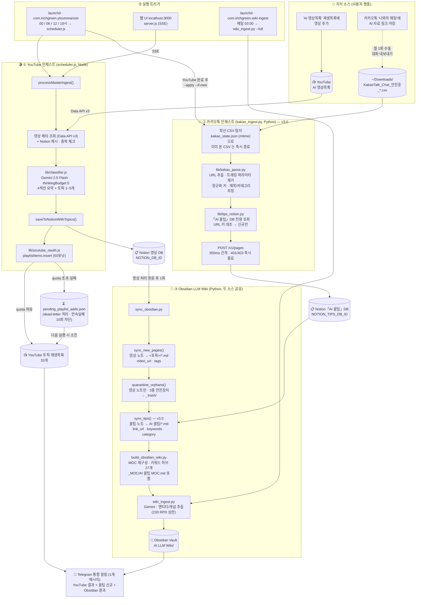

# 🎬 YouTube + 📎 카카오톡 → Notion → Obsidian LLM Wiki

**현재 버전: v3.0** (2026-09-06)

YouTube 재생목록의 영상을 **Gemini AI**로 자동 요약하고, 카카오톡 '나와의 채팅'에 저장해 둔 **AI 자료 링크**를 자동 수집하여
각각 **Notion DB**(영상 DB ·「AI 꿀팁」DB)에 적재한 뒤, **Obsidian**으로 동기화해 하나의 **LLM Wiki** 지식베이스로 합성하는 자동화 파이프라인입니다.

> v3.0부터 지식 소스가 **YouTube 영상 + 카카오톡 링크** 두 갈래가 되었습니다. Notion 이후 단계(Obsidian 노트 → Wiki 합성 → MOC)는 두 소스가 완전히 공유합니다.

---

## 🚀 프로젝트 개요
본 프로젝트는 AI 에이전트 기술을 활용하여 구현 및 고도화되었습니다.
* **AI Assistant**: Claude (Anthropic) — Agentic Coding
* **AI Model**: **Gemini 2.5 Flash** — YouTube 영상 요약 및 분류 엔진
* **Coding Style**: **Vibe Coding** (AI-driven iterative design & implementation)

---

## ✨ 주요 기능

- 🎥 **YouTube 재생목록 자동 수집** — YouTube Data API v3로 재생목록 영상 전체 조회
- 🤖 **Gemini AI 자동 요약** — 영상 제목·설명·태그 기반 4섹션 보고서 자동 생성
- 📝 **Notion DB 자동 저장** — 요약 결과를 Notion 데이터베이스에 구조화하여 저장
- 🔄 **스마트 중복 방지** — Notion 전체 캐시 로드 후 메모리에서 즉시 중복 체크
- 📊 **통계 자동 업데이트** — 조회수·구독자수 15% 이상 변화 시만 Notion API 호출
- 📎 **카카오톡 링크 자동 수집 (v3.0)** — '나와의 채팅' 내보내기 CSV에서 AI 자료 링크를 추출·정규화해 Notion「AI 꿀팁」DB에 신규만 적재 (DB 대조 기반 멱등성)
- 📓 **Obsidian 자동 동기화** — 영상 DB +「AI 꿀팁」DB 신규 항목을 Obsidian 노트로 생성, LLM Wiki 자동 합성
- 🔗 **Wiki 링크 자동 구성** — 재생목록별 MOC, 채널별 목차, 키워드 링크 자동 생성
- 📱 **텔레그램 알림** — 노션 저장 결과 + Obsidian 동기화 결과 통합 전송
- ⏰ **launchd 자동 스케줄링** — Mac 로그인 시 서버 자동 시작, 6시간 간격 스케줄러 실행

---

## 🏗️ 시스템 아키텍처 (v3.0)

### 전체 데이터 흐름



### 한 사이클(6시간)에서 실제로 일어나는 일

| 순서 | 단계 | 실행 주체 | 입력 | 출력 | 아무 것도 없을 때 |
|:--:|---|---|---|---|---|
| 1 | YouTube 마스터 인제스트 | `scheduler.js` | 'AI 영상목록' 신규 영상 | Notion 영상 DB 행 + 토픽 재생목록 추가 | Notion 캐시 대조 후 0건 처리 |
| 2 | 대기 큐 소진 | `scheduler.js:flushPendingQueue()` | `pending_playlist_adds.json` | 재생목록 추가 (quota 한도 내) | 큐 비어 있으면 생략 |
| 3 | 카톡 인제스트 (v3.0) | `kakao_ingest.py --apply --if-new` | `~/Downloads` 최신 CSV | Notion「AI 꿀팁」신규 행 | 같은 CSV(mtime)면 Notion 조회 없이 즉시 종료 |
| 4 | 영상 노트 동기화 | `sync_obsidian.py:sync_new_pages()` | Notion 영상 DB | `VAULT/<토픽>/*.md` | 0건 |
| 5 | 고아 격리 | `sync_obsidian.py:quarantine_orphans()` | Vault 영상 노트 vs Notion | `_trash/<ts>/` 이동 | 3중 안전장치 하나라도 걸리면 아무것도 안 함 |
| 6 | 꿀팁 노트 동기화 (v3.0) | `sync_obsidian.py:sync_tips()` | Notion「AI 꿀팁」DB | `VAULT/AI 꿀팁/*.md` | 0건 |
| 7 | MOC·키워드 재구성 | `build_obsidian_wiki.py` | Vault 전체 | `_MOC/*.md`, 노트 하단 관련 항목 | 4·5·6이 전부 0건이면 생략 |
| 8 | Wiki 합성 | `wiki_ingest.py` | 미처리 노트 | `wiki/entities`, `wiki/concepts` | 신규 노트 없으면 생략 |
| 9 | 알림 | `scheduler.js` | 1·3·4~8 결과 | Telegram 1개 메시지 | 변경 0이면 발송 생략 |

### 두 소스의 격리 원칙

영상 노트와 꿀팁 노트는 **같은 Vault, 다른 폴더, 다른 프론트매터 키**를 쓴다. 이 구분이 고아 격리 안전장치를 지킨다.

| | 영상 노트 | 꿀팁 노트 (v3.0) |
|---|---|---|
| 폴더 | `<토픽명>/` (33개) | `AI 꿀팁/` (평면, 하위 폴더 없음) |
| 원본 링크 키 | `video_url` | `link_url` — **`video_url` 절대 금지** |
| 분류 키 | `tags: [..]` (Notion 주제와 동기화) | `keywords: [..]` + `category` — `tags` 없음 → 폴더명 MOC |
| 고아 격리 대상 | ✅ | ❌ (`get_existing_vault_info()`가 폴더를 걷지 않음) |
| 파일명 | `<채널>_<제목>_<날짜>.md` | `<저장일>_<제목>.md` (충돌 시 `_<id 끝 6자리>`) |
| Wiki 합성 | ✅ 본문 요약 기반 | ✅ 제목·태그·메모 기반 (본문이 거의 없어 추출 품질은 낮음) |

---

## 📂 프로젝트 구조

```
Youtube_Notion_Grap/
├── server.js                          # 웹 서버 + Notion API 프록시 + Obsidian 트리거
├── scheduler.js                       # 자동 스케줄러 (6시간 간격, 마스터 인제스트 포함)
├── index.html                         # 웹 앱 UI (단일 파일)
├── package.json                       # Node.js CommonJS 설정
├── playlists.json                     # 등록된 재생목록 목록
├── .env                               # API 키 (gitignore — 절대 커밋 금지)
├── favicon.svg                        # 브라우저 탭 아이콘
├── migrate_classify.js                # 기존 영상 일괄 재분류 스크립트 (v102)
├── oauth_setup.js                     # YouTube OAuth refresh_token 1회 발급 도구 (v102)
├── notion_to_obsidian.js              # Notion → Obsidian 일회성 마이그레이션
├── kakao_ingest.py                    # (v3.0) 카톡 CSV → Notion「AI 꿀팁」 (기본 dry-run, --apply / --if-new)
├── sync_obsidian.py                   # Obsidian 증분 동기화 (영상 노트 + 꿀팁 노트, 고아 격리, 위키 인제스트 연동)
├── wiki_ingest.py                     # Gemini 기반 엔티티/개념 위키 페이지 합성 스크립트 (v111)
├── wiki_config.py                     # Wiki Ingest 공통 설정 및 API 호출 유틸 (v111)
├── build_obsidian_wiki.py             # MOC + 채널 목차 + 키워드 링크 빌더
├── cleanup_duplicates.py              # 노션/Obsidian 중복 정리 도구
├── com.irichgreen.server.plist        # launchd 서버 자동시작 설정
├── com.irichgreen.ytsummarizer.plist  # launchd 스케줄러 설정
├── com.irichgreen.wiki-ingest.plist   # launchd 일일 Wiki 인제스트 스케줄러 (v111)
├── install-server.sh                  # 서버 자동시작 설치 스크립트
├── install-scheduler.sh               # 스케줄러 설치 스크립트
├── install-wiki-ingest.sh             # 일일 Wiki 인제스트 스케줄러 설치 스크립트 (v111)
├── lib/
│   ├── youtube_oauth.js               # YouTube OAuth 2.0 + playlistItems.insert (v102)
│   ├── classifier.js                  # Gemini 기반 토픽 분류기 (v102)
│   ├── kakao_parse.py                 # (v3.0) URL 추출·정규화·중복 키·제목/카테고리 추정 (순수 함수)
│   └── tips_notion.py                 # (v3.0) 「AI 꿀팁」DB 조회/생성 래퍼 (속성 타입 표 고정)
├── scripts/
│   └── clean_pending_queue.js         # (v2.5) 대기 큐 중복 제거 + dead-letter 격리
├── docs/tasks/                        # Cowork → Claude Code 작업지시서 (날짜-슬러그.md)
├── CLAUDE.md                          # 구조·제약·안전장치 — 코드 질문은 여기부터
└── README.md                          # 이 문서 (v3.0부터 README.html 은 만들지 않는다)
```

---

## 🛠️ 기술 스택

| 분류 | 기술 |
|------|------|
| **Runtime** | Node.js v25+, Python 3 |
| **Backend** | Node.js HTTP 서버 (Notion API 프록시) |
| **Frontend** | Vanilla HTML/CSS/JavaScript (Single File) |
| **AI 요약** | Google Gemini 2.5 Flash API |
| **데이터 소스** | YouTube Data API v3 |
| **저장소** | Notion Database API |
| **Wiki** | Obsidian (로컬 마크다운 지식베이스) |
| **알림** | Telegram Bot API, Gmail SMTP |
| **스케줄링** | macOS launchd |

---

## 🔑 환경 변수 설정 (.env)

프로젝트 루트에 `.env` 파일을 생성하세요. (GitHub에 절대 올리지 않습니다)

```env
YOUTUBE_API_KEY=AIzaSy...
GEMINI_API_KEY=AIzaSy...
NOTION_TOKEN=ntn_...
NOTION_DB_ID=xxxxxxxxxxxxxxxxxxxxxxxxxxxxxxxx        # YouTube 영상 DB

# (v3.0) 카카오톡 →「AI 꿀팁」 — NOTION_DB_ID 와 반드시 다른 변수명. 섞으면 영상 파이프라인이 엉뚱한 DB에 쓴다
NOTION_TIPS_DB_ID=xxxxxxxxxxxxxxxxxxxxxxxxxxxxxxxx   # 「AI 꿀팁」DB (같은 NOTION_TOKEN 통합에 연결 필요)
KAKAO_EXPORT_DIR=/Users/<사용자>/Downloads          # KakaoTalk_Chat_안진훈_*.csv 가 떨어지는 폴더

TELEGRAM_ENABLED=true
TELEGRAM_BOT_TOKEN=1234567890:AAG...
TELEGRAM_CHAT_ID=1234567890

EMAIL_ENABLED=false
EMAIL_FROM=your@gmail.com
EMAIL_TO=recipient@email.com
EMAIL_APP_PASS=xxxx xxxx xxxx xxxx

# YouTube OAuth 2.0 (v102 — 토픽 재생목록 자동 추가용)
# oauth_setup.js 실행 후 자동 기입됩니다
YOUTUBE_OAUTH_CLIENT_ID=...
YOUTUBE_OAUTH_CLIENT_SECRET=...
YOUTUBE_OAUTH_REFRESH_TOKEN=...
YOUTUBE_MASTER_PLAYLIST_ID=PLxxxxxxxxxxxxxxxxxxxxxxxx
```

---

## 📦 설치 및 실행

### 1. 사전 요구사항
- Node.js v18 이상, Python 3
- YouTube Data API v3 키
- Google Gemini API 키
- Notion Integration 토큰 + 데이터베이스 ID

### 2. 서버 및 스케줄러 실행
```bash
# 서버 수동 실행
node server.js

# Mac 자동 시작 등록
bash install-server.sh
bash install-scheduler.sh
```

### 3. 카카오톡 링크 인제스트 (v3.0)

```bash
# 카카오톡 PC → '나와의 채팅' → 대화 내보내기 → ~/Downloads 에 CSV 저장 (월 1회 정도)
# 이후는 스케줄러가 자동 처리한다. 수동으로 돌릴 때는 반드시 dry-run 부터.
/usr/bin/python3 kakao_ingest.py                    # dry-run — 생성될 행을 표로만 출력
/usr/bin/python3 kakao_ingest.py --apply --limit=3  # 3건만 생성 → Notion 육안 확인
/usr/bin/python3 kakao_ingest.py --apply            # 전량
/usr/bin/python3 lib/tips_notion.py                 # 「AI 꿀팁」DB 상태 (건수·카테고리 분포)
```

> 인터프리터는 `/usr/bin/python3` 또는 `/opt/homebrew/bin/python3`. PATH 의 `python3`(python.org 3.11)는 루트 인증서가 없어 Notion 호출이 SSL 오류로 죽는다.

---

## 📓 Obsidian LLM Wiki

노션에 저장된 AI 영상 요약을 Obsidian 지식베이스로 자동 변환하며, `wiki_ingest.py`를 통해 지식 간의 관계를 분석하여 위키 페이지를 합성합니다. 자세한 구조는 [CLAUDE.md](CLAUDE.md)를 참조하세요.

---

## 📊 Notion DB 컬럼 구조

| 컬럼명 | 타입 | 설명 |
|--------|------|------|
| 영상 제목 | Title | YouTube 영상 제목 |
| 요약 내용 | Rich Text | Gemini AI 생성 4섹션 보고서 |
| 유튜브 채널 | Rich Text | 채널명 |
| 업로드 일자 | Date | 실제 영상 업로드 날짜 |
| 조회수 | Number | 최신 조회수 |
| 구독자수 | Number | 채널 구독자수 |
| 영상 URL | URL | YouTube 영상 링크 |
| 썸네일 URL | URL | 영상 썸네일 이미지 |
| 처리 상태 | Select | 완료 / 오류 |
| 주제 | Multi-Select | 재생목록명 (NFC 정규화 적용) |

### 「AI 꿀팁」DB (v3.0) — `NOTION_TIPS_DB_ID`

속성 타입은 `lib/tips_notion.py` 상단 주석이 원본이다. 추측해서 쓰면 400이 난다.

| 컬럼명 | 타입 | 값 · 비고 |
|--------|------|------|
| 제목 | Title | 규칙 기반 추정 (`<레포명> (GitHub 레포)`, `노션 자료 (…)`). 슬러그에 한글이 없으면 `(제목 미확인)` |
| URL | URL | 트래킹 파라미터(`utm_*`, `fbclid`, `pvs`, `source`…)를 제거한 원본 링크 |
| 출처 | URL | **호스트만** 저장 (`github.com`, `xxx.notion.site`) |
| 태그 | Rich Text | 쉼표 결합 문자열 (`ClaudeCode,GitHub`) — multi_select 가 아니다 |
| 카테고리 | Select | 프롬프트 / 개발툴 / 기타 / 모델/LLM / 뉴스/트렌드 / 지식관리 / 사업/마케팅 |
| 상태 | Select | 미확인 (생성 시 기본값) |
| 중요도 | Select | 상 / 중 / 하 (생성 시 기본 `중`) |
| 저장일 | Date | 카톡 메시지 날짜 |
| 메모 | Rich Text | `원문 확인 필요` 등 추정 근거 |

---

## 🔄 버전 관리 (Version History)

본 프로젝트는 **`v[Major].[Minor]`** 형식의 단순화된 버전 규칙을 따릅니다.
- **Major**: 핵심 엔진 교체, 아키텍처 개편 등 대규모 변화
- **Minor**: 기능 개선, 버그 수정, 프롬프트 튜닝 등 마이너한 변화

### 📌 요약 이력 (Summary Table)

| 버전 | 날짜 | 주요 내용 요약 |
| :-- | :--- | :--- |
| **v3.0** | 2026-09-06 | **지식 소스 2원화 — 카카오톡 링크 파이프라인 통합**: 카카오톡 '나와의 채팅' CSV → Notion「AI 꿀팁」DB → Obsidian `AI 꿀팁/` 노트 → 기존 Wiki 합성·MOC 를 그대로 공유. `kakao_ingest.py`·`lib/kakao_parse.py`·`lib/tips_notion.py` 신규, `sync_obsidian.py:sync_tips()`, `scheduler.js` 훅(`--apply --if-new`), 텔레그램 통합 알림. 영상 노트와 꿀팁 노트의 격리 원칙 확립. `README.html` 폐지 |
| **v2.7.1** | 2026-08-28 | **토픽 분류의 일시적 서버 오류(5xx) 재시도 추가**: 요약 경로는 503에 키 로테이션 + 재시도로 대응하는 반면 분류 경로는 429/quota만 재시도 대상이라 503 한 번에 영상이 떨어지던 비대칭을 교정하고, 재시도 소진 시 발생하던 잠복 TypeError 경로를 차단 |
| **v2.7** | 2026-08-19 | **재생목록 쓰기 성공/실패 계측 및 알림 교정**: `.quota_state.json`이 성공·실패를 구분하지 않아 "시도했으나 전부 실패한 날"을 감지하지 못하던 구멍을 막고, 텔레그램 알림에 당일 배수량·유입량·순감 기준 소진 예상일을 표기 |
| **v2.6** | 2026-08-17 | **quota 일 경계 태평양시(PT) 교정**: `.quota_state.json`의 날짜 키가 UTC라 KST 09:00에 리셋되는 반면 YouTube 실제 quota는 PT 자정(KST 16:00)에 리셋되어, 그 7시간 동안 스로틀이 무력화되던 문제를 교정 |
| **v2.5** | 2026-08-17 | **재생목록 대기큐 정합성 및 API 어뷰징 차단**: 중복 적재 원천 차단, 영구 실패 dead-letter 격리(재시도 5회 상한), 연속 실패 10회 시 큐 처리 즉시 중단, 실패 요청의 quota 계상 누락 교정, 텔레그램 큐 적체 알림 추가 |
| **v2.4** | 2026-07-08 | **주제 분류 API 키 로테이션 적용 및 안정성 강화**: 주제 분류 단계(`classifyTopics`)에서 429 에러(할당량 초과) 발생 시 다음 API Key로 자동 전환(`rotateGeminiKey()`) 후 재시도하는 로직을 추가하여 무중단 인제스트의 안정성을 극대화함 |
| **v2.3** | 2026-06-02 | **비용 최적화 및 무료 Key 로테이션 적용**: 요약 스케줄러 내 누락되었던 비용 절감 옵션 추가 적용 및 다중 무료 API 키 로테이션 구축으로 비용 0원 가동 환경 마련 |
| **v2.2** | 2026-05-21 | **API 보안 킬스위치 및 안전장치 강화**: API 키 정지 감지 시 프로세스 즉시 종료, 스케줄러 영구 언로드, 보안 스킬 규정 지정 |
| **v2.1** | 2026-05-18 | **요약 안정성 극대화 및 지식베이스 정상화**: 요약 짤림 완전 방지, RAG 기술 분류 보강 및 3MB 오류 큐 정리 |
| **v2.0** | 2026-05-16 | **할당량 최적화 및 안정성 강화**: 배치 크기 하향 및 순차 처리 도입 |
| **v1.2** | 2026-05-12 | **Karpathy LLM Wiki & 비용 최적화**: Wiki Ingest 구현 및 비용 85% 절감 |
| **v1.1** | 2026-05-02 | **개발 환경 및 분류 지능화**: CLAUDE.md 도입 및 바이브코딩 매핑 강화 |
| **v1.0** | 2026-04-10 | 프로젝트 초기화 및 핵심 파이프라인 구축 단계 |

---

### 📝 상세 변경 내역 (Detailed Change Log)

#### [v3.0] — 2026-09-06 (📎 지식 소스 2원화 — 카카오톡 링크 파이프라인 통합)

**왜 메이저 버전인가.** v1~v2 는 "YouTube 영상 → Notion → Obsidian" 한 줄 파이프라인의 안정화·최적화였다. v3.0 은 **두 번째 지식 소스(카카오톡에 저장한 AI 자료 링크)를 같은 Obsidian LLM Wiki 로 합류**시키는 아키텍처 확장이다. Notion 이전 단계는 소스별로 분리되고, Notion 이후 단계(노트 생성 → Wiki 합성 → MOC → 알림)는 공유한다. 합성 로직을 두 벌 만들지 않는 것이 핵심 설계 판단이다.

**① 카카오톡 → Notion「AI 꿀팁」 (신규 Python 모듈 3개)**
- `lib/kakao_parse.py` — CSV(`Date,User,Message`, UTF-8 BOM) 파싱, URL 추출, **트래킹 파라미터 제거**(`fbclid utm_* pvs si mcp_token _phid _phsrc source shareKey navType pli usp gclid igshid`), 중복 판정 키(`https` 통일·소문자 호스트·`www.` 제거·끝 슬래시 제거·fragment 제거), 규칙 기반 제목/카테고리/태그 추정. 순수 함수, 네트워크 없음.
- `lib/tips_notion.py` — 「AI 꿀팁」DB 조회/생성 래퍼. **속성 타입 표를 주석에 고정**(`태그`=rich_text 쉼표 결합, `출처`=url 타입이지만 호스트만). 401/403 → `NotionAuthError` 로 즉시 종료(보안 원칙 1), 429/5xx → 지수 백오프 2·4·8·16초(원칙 2), 생성 간 350ms(3 req/s).
- `kakao_ingest.py` — 진입점. **기본 dry-run**, `--apply` 로만 생성. `--since` 기본 `2026-03-01`(DB 시작일 — 그 이전 카톡 링크 103건은 쇼핑·개인 링크). **중복 판정은 상태 파일이 아니라 DB 전량 조회 + URL 키 대조** — 같은 CSV 를 몇 번 돌려도 0건이어야 정상이며, 2026-09-06 CSV 병합 2회 실행으로 15건이 중복 생성된 사고의 재발 방지 조건이다. `--if-new` 는 `.kakao_state.json`(최신 CSV 의 mtime)을 보고 이미 본 CSV 면 Notion 조회 없이 즉시 종료하는 **스킵 최적화일 뿐 중복 방지 장치가 아니다.** 마지막 줄 `RESULT_JSON:{csv,created,candidates,db_total,titles}` 를 스케줄러가 파싱.
- 검증: 기존 CSV 재실행 0건(멱등성), 2회 연속 실행 0건, `?source=copy_link`·끝 슬래시·`www.` 차이가 같은 키로 판정, 테스트 행 1건 생성→재조회→아카이브로 생성 경로 확인, `/opt/homebrew/bin/python3`(3.14)·`/usr/bin/python3`(3.9) 양쪽 SSL 동작 확인.

**② Notion「AI 꿀팁」→ Obsidian (`sync_obsidian.py:sync_tips()`)**
- `VAULT/AI 꿀팁/` **평면 폴더**에 `<저장일>_<제목>.md` 생성(신규만). 같은 날 같은 추정 제목이 여럿이면 `_<notion_id 끝 6자리>` 를 붙인다 — 덮어쓰기로 `notion_id` 가 유실되면 매 실행 재생성되기 때문. 앞 6자리는 워크스페이스 공통 접두(`3bca3c…`)라 구분이 안 된다.
- 프론트매터는 `link_url`·`keywords`·`category`·`importance`·`status`·`channel`(=출처 호스트)·`upload_date`(=저장일)·`notion_id`. **`video_url` 과 `tags` 를 쓰지 않는다.** `video_url` 을 쓰면 고아 격리 대상이 되고, `tags` 가 없어야 `build_obsidian_wiki` 가 폴더명 MOC(`_MOC/AI 꿀팁 MOC.md`)로 묶는다.
- **YouTube 로직과의 격리**: `get_existing_vault_info()` 가 `AI 꿀팁/` 를 걷지 않으므로 고아 격리의 분모(안전장치 2 — Notion 건수 < Vault 50%)와 `sync_existing_tags()` 에 섞이지 않는다. `--orphans-dry-run` 으로 확인 — 꿀팁 99개 존재 상태에서 notion_id 등록 파일 2,542개(기준선과 동일)·고아 0.
- `--no-tips` 옵션, `RESULT_JSON.tips_added` 추가. 실행 순서는 영상 노트 → 고아 격리 → **꿀팁 노트** → MOC → Wiki 합성.
- 첫 적재 99건. 꿀팁 노트는 본문이 거의 없어(제목·링크·태그·메모) `wiki_ingest` 추출 품질이 낮다. URL 본문을 긁어 Gemini 로 요약하는 2차 확장은 미구현(선택).

**③ 스케줄러 통합 (`scheduler.js`, 지시서 `docs/tasks/2026-09-06-scheduler-kakao-hook.md`)**
- YouTube 인제스트 완료 → `kakao_ingest.py --apply --if-new` → `sync_obsidian.py` 순서. 카톡 단계는 절대 reject 하지 않아 Obsidian 동기화를 막지 않는다. Notion 401/403 이면 로그만 남기고 다음 단계로.
- 텔레그램은 기존 1개 메시지에 `📎 카톡 → AI 꿀팁` 섹션과 `신규 꿀팁 노트 N개` 를 추가. 메시지를 2개로 나누지 않는다.

**④ 운영·문서**
- `.env` 에 `NOTION_TIPS_DB_ID`·`KAKAO_EXPORT_DIR`. `NOTION_DB_ID`(영상용)와 다른 변수명이다.
- `.gitignore` 에 `.kakao_state.json`, `KakaoTalk_Chat_*`(개인 대화 — 레포에 절대 포함 금지).
- **`README.html` 폐지.** 앞으로 `README.md` 만 갱신한다(CLAUDE.md 산출물 규칙 갱신).
- 발견한 사실: PATH 의 `python3`(python.org 3.11)는 루트 인증서가 없어 Notion 호출이 `CERTIFICATE_VERIFY_FAILED` 로 죽는다. 데몬이 쓰는 `/usr/bin/python3`·`/opt/homebrew/bin/python3` 는 정상.
- 첫 적재 중 사고 1건: `--orphans-dry-run` 검증 실행이 꿀팁 5건을 신규로 잡으면서 `wiki_ingest.py` 를 **제한 없이** 띄웠다(기존 동작). 25건 호출 후 수동 중단, 상태 손실 없음. 대량 적재 시 `sync_tips()` 단독 → `wiki_ingest.py --limit=20` 분할 규칙을 CLAUDE.md 에 남겼다.
- 변경 없음: YouTube 인제스트·quota·대기 큐·OAuth·고아 격리 안전장치·Wiki 합성 로직.

#### [v2.7.1] — 2026-08-28 (🔁 토픽 분류의 일시적 서버 오류(5xx) 재시도 추가)
- **503 한 번에 영상이 떨어지던 비대칭 교정**: 요약 단계는 8회 재시도 + API Key 로테이션으로 `503 UNAVAILABLE`을 흡수하는데, 분류 단계(`classifyTopics`)의 재시도 조건은 **429/quota만** 포함해 그 외 오류는 즉시 `throw`되었음. 2026-08-28 06:00 실행에서 동일한 503으로 요약은 통과하고 분류만 실패(`classifyTopics failed after 1 attempts`)해 영상 1건이 6시간 뒤 실행으로 밀려남. `5xx`·`UNAVAILABLE`·`overloaded`·`high demand`를 재시도 대상에 추가함.
- **지수 백오프 적용**: 일시적 서버 오류는 고정 1초가 아닌 2→4→8→15초(상한) 지수 백오프로 대기 (CLAUDE.md 보안 원칙 2). 최대 8회 기준 최악 누적 74초이며 실제 장애 상황에서만 발생함.
- **401/403 즉시 중단 명시화**: 인증·권한 오류는 재시도 대상에서 명시적으로 제외해 실패 요청 연쇄를 원천 차단 (보안 원칙 1). 기존에는 조건에 우연히 걸리지 않아 중단되던 것을 코드로 못박음.
- **키 1개 환경에서도 재시도**: 기존 `keysCount > 1` 조건을 재시도 자체에서 분리하고 키 교체(`rotateGeminiKey()`)에만 적용해, API Key가 하나뿐이어도 일시적 오류는 대기 후 재시도하도록 변경.
- **잠복 TypeError 경로 차단**: 마지막 시도가 `continue`로 끝나면 `cls`가 `undefined`인 채 루프를 빠져나와 바로 다음 줄 `cls.topics`에서 `TypeError`로 죽는 경로가 있었음. 재시도 조건의 `clsAttempt < maxClsAttempts` 가드와 루프 직후 `if (!cls) throw` 가드 2개로 차단함.
- `lib/classifier.js`(`maxRetries` 기본값·프롬프트·`allowedSet` 필터)·요약 경로·quota·대기큐 로직은 변경 없음.

#### [v2.7] — 2026-08-19 (📊 재생목록 쓰기 성공/실패 계측 및 알림 교정)
- **"전부 실패한 날"을 감지하지 못하던 구멍 차단**: 큐 적체 경고의 발화 조건이 `.quota_state.json`의 `date !== today` 하나뿐이었는데, v2.5에서 실패 요청도 `consumeQuota(50)`을 타게 되면서 **실패만 해도 `date`가 당일로 갱신**되어 경고가 무력화되던 문제를 교정. 이 구조 탓에 2026-08-17의 197건 연속 `403 playlistItemsNotAccessible` 상황에서 원인을 지목하는 경고가 한 건도 발송되지 않았음. quota state에 `ok`/`fail` 카운터를 추가하고, **인증은 되는데 쓰기만 전부 실패**하는 계정 불일치 시나리오를 별도 분기로 경고하도록 변경.
- **성공/실패 계측 도입**: `lib/youtube_oauth.js`의 `consumeQuota(units, outcome)`로 확장하여 `playlistItems.insert`의 성공·실패 경로에서 각각 계상. 읽기(`list`)는 계상 대상에서 제외해 `used`에만 반영. 기존 상태 파일에 `ok`/`fail`이 없으면 0으로 채워 **하위호환을 유지**하며, 날짜 경계에서 `used`와 함께 리셋됨.
- **알림 문구 3분기 + 순감 기준 소진 예상일**: 텔레그램 완료 요약이 잔량만 표시하고 배수량을 세지 않아 정상 배수(2026-08-18 190건)가 드러나지 않던 문제를 교정. 당일 배수량·유입량을 함께 표기하고, 소진 예상일을 `(잔량 ÷ 190)`이 아닌 **`(잔량 ÷ 순감)` 기준**으로 계산하도록 변경 — 유입을 무시하던 기존 계산은 실제(약 16.8일)보다 낙관적인 11.8일을 표시했음. 순증 중일 때는 예상일 대신 경고를 표기.
- 임계값(9,500)·소비량(50/1유닛)·일 경계(PT)·대기큐 안전장치는 변경 없음.

#### [v2.6] — 2026-08-17 (🕐 quota 일 경계 태평양시(PT) 교정)
- **일 경계 UTC → PT 교정**: `lib/youtube_oauth.js`의 `todayKey()`가 UTC 날짜를 쓰던 탓에 로컬 카운터가 KST 09:00에 0으로 리셋되는 반면, YouTube 실제 quota는 태평양시 자정(= KST 16:00)에 리셋되어 **KST 09:00~16:00 구간에서 `checkQuotaAvailable()`이 무조건 통과**하던 문제를 교정. 실패 요청도 50유닛을 소비하므로(v2.5) 이 구간에서는 이미 소진된 quota에 계속 요청을 밀어넣는 상태였음. `Intl.DateTimeFormat('en-CA', { timeZone: 'America/Los_Angeles' })` 기반으로 변경하여 DST(PDT/PST) 전환도 자동 처리.
- **텔레그램 오경보 제거**: `scheduler.js`의 quota 미갱신 경고가 동일한 UTC 키로 비교하던 탓에 KST 09:00~16:00 사이에는 정상 동작 중에도 `🛑 오늘 YouTube 쓰기 0건`이 발송되던 문제를 교정. `todayKey()`를 export하여 스케줄러와 quota 추적기가 **같은 날짜 키를 공유**하도록 일원화함.
- 임계값(9,500)·소비량(50/1유닛)·대기큐 안전장치는 변경 없음.

#### [v2.5] — 2026-08-17 (🧹 재생목록 대기큐 정합성 및 API 어뷰징 차단)
- **중복 적재 원천 차단**: `scheduler.js`·`migrate_classify.js`의 `appendPending()`이 무조건 `push`하던 탓에 동일 `(videoId, playlistId)` 조합이 최대 28회까지 중복 적재되어 대기큐의 46.7%가 중복으로 채워지던 문제를 교정. 적재 전 동일 조합 존재 여부를 검사하여 재적재를 차단함.
- **영구 실패 dead-letter 격리**: `flushPendingQueue()`의 "기타 오류" 분기가 `403 playlistItemsNotAccessible` 같은 영구 실패까지 큐에 되돌려 영원히 재시도하던 구조를 개선. 영구 실패 사유(`playlistItemsNotAccessible`, `playlistNotFound`, `videoNotFound`, `forbidden`)는 `pending_playlist_adds.dead.json`으로 격리하고, 일시적 오류도 `retryCount` 5회를 넘기면 함께 격리하여 **어떤 실패도 무한 순환하지 않도록** 보장함.
- **연속 실패 차단기(Circuit Breaker)**: 계정·권한 문제로 실패가 연쇄될 때 수백 건의 403 요청을 난사하던 동작을 차단. 연속 10회 실패 시 큐 처리를 즉시 중단하고 잔여 항목을 보존함 (CLAUDE.md 보안 원칙 1 — 연쇄 요청 금지 준수).
- **실패 요청 quota 계상 교정**: `lib/youtube_oauth.js`가 성공 응답에서만 `consumeQuota(50)`를 호출해, 실패한 `playlistItems.insert`가 소비한 실제 quota가 `.quota_state.json`에 반영되지 않던 문제를 교정. 로컬 카운터가 0에 머문 채 실제 일일 한도를 초과하던 원인이었음.
- **큐 적체 알림 추가**: 대기큐가 3개월간 5,392건까지 누적되도록 아무 경보가 없던 문제를 보완. 텔레그램 완료 요약에 잔량·소진 예상일을 상시 표기하고, 1,000건 이상 적체 시와 `.quota_state.json`이 당일 갱신되지 않은 경우(= 당일 YouTube 쓰기 0건) 경고를 함께 발송함.
- **재실행 가능한 큐 정리 스크립트**: `scripts/clean_pending_queue.js` 신규 추가. 중복 제거(최초 `ts` 보존), `playlists.json` 미등록 재생목록 및 영구 실패 항목의 dead-letter 격리를 수행하며, 기본 `--dry-run`·`--apply` 시 타임스탬프 백업 생성.

#### [v2.4] — 2026-07-08
- **주제 분류 API 키 로테이션 적용 및 안정성 강화**: 주제 분류 단계(`classifyTopics`)에서 429 에러(할당량 초과) 발생 시 다음 API Key로 자동 전환(`rotateGeminiKey()`) 후 재시도하도록 개선하여 특정 API Key의 한도 초과 상황에서도 스케줄러의 무중단 인제스트 무결성을 확보함.

#### [v2.3] — 2026-06-02
- **Gemini 2.5 Flash 비용 최적화 옵션 추가 적용**: `scheduler.js`에서 Gemini 2.5 Flash를 통한 요약 수행 시 누락되었던 `thinkingConfig: { thinkingBudget: 0 }`를 추가하여, 보이지 않는 백그라운드 추론 토큰 과금(Thinking Quota)으로 인해 비용이 과다 청구되던 현상을 원천 방지(비용 약 85% 이상 절감).
- **무료 API Key 로테이션 적용**: 결제 카드가 연결되지 않은 4개의 순수 무료 API 키(`anvaksa@gmail.com`, `irichgreen.ai@gmail.com` 등)를 생성하여 `.env` 내 `GEMINI_API_KEYS`에 멀티 등록. 429 에러(무료 한도 초과) 발생 시 자동으로 다음 키로 교환 작동하도록 스케줄러 동작을 보완하여 **비용 0원 무과금 가동 환경**을 구축함.

#### [v2.2] — 2026-05-21
- **API 403 Suspended 에러 킬스위치(Kill-switch) 구현**: Gemini API 키가 차단(`suspended`)되었을 때 무한 루프를 돌며 API 호출을 시도하지 않고, 즉시 텔레그램으로 경보를 보낸 뒤 `process.exit(1)` 및 `sys.exit(1)`로 안전하게 프로세스를 강제 종료하는 안전장치 추가.
- **백업용 지수 백오프(Exponential Backoff)**: 일시적인 오류(429, 5xx)에 대해 단순 고정 3초 대기 대신 점진적으로 대기 간격을 늘리는 지수 백오프 알고리즘 적용 (`scheduler.js`, `wiki_config.py`).
- **백그라운드 자동 스케줄러 완전 정지 및 plist 삭제**: 백그라운드 오작동으로 인한 구글 계정의 비정상 활동 감지 리스크를 차단하기 위해 launchd 스케줄러(`ytsummarizer`, `wiki-ingest`)를 완전 언로드 및 설정 파일(plist) 2종을 영구 삭제 처리.
- **보안 및 안전 최우선 지침 지정**: `SKILL_SAFETY.md`를 생성하여 AI 에이전트의 API 남용과 비정상 호출을 차단하는 가이드를 스킬로 지정하고, `CLAUDE.md`에도 이 보안 최우선 개발 원칙을 명문화함.

#### [v2.1] — 2026-05-18
- **요약 무결성 검증 (`validateSummary`)**: Notion 저장 전 4대 필수 섹션(영상 개요, 핵심 내용, 주요 인사이트, 활용 포인트)의 유실 여부를 자동 판별하는 검증 로직 도입.
- **자동 Fallback 재시도**: 검증 실패 시 짧고 밀도 높은 `fallbackPrompt`를 태워 최대 2회까지 자동으로 요약을 재생성하는 자가 치유(Self-healing) 기능 구축.
- **Gemini 용량 확장**: maxOutputTokens를 `2000`에서 `4000`으로 상향하여 한국어 요약 도중 문장이 뚝 끊기는 절단 문제 차단.
- **정밀 제목 정규화 (`normalizeTitle`)**: 띄어쓰기, 인코딩(NFC/NFD), 특수기호 및 이모지 차이를 정제 대조하는 비교 엔진을 추가하여 중복 저장 차단.
- **RAG & 콘텐츠 자동화 분류 보완 (`classifier.js`)**: 칭킹, 벡터 DB, 하이브리드 검색 등 RAG 기술군이 `'AI LLM Wiki'` 카테고리로 정확히 매핑되고, AI 에이전트 기반 콘텐츠 대량 자동화가 `'AI 자동화'`에 고스란히 태깅되도록 프롬프트 정밀 튜닝.
- **오류 큐 대청소 (`clean_pending_queue.js`)**: 회복 불가능한 API 403 오류로 3MB 수준까지 불어났던 9,514개의 무한 실패 대기 항목을 깨끗이 정리 및 경량화.
- **Obsidian 짤림 파일 일괄 자가 복구**: 과거에 잘렸던 Obsidian 로컬 마크다운 파일 13개를 디텍션하여 선제적으로 삭제하고, Notion 최신 완전본으로 동기화(sync_obsidian.py)하여 Karpathy LLM Wiki 지식 합성까지 물 흐르듯 가동 성공.

#### [v2.0] — 2026-05-16
- **할당량 최적화**: `scheduler.js`의 `MAX_NEW_PER_RUN`을 15개로 하향 조정하여 Gemini API 할당량 대응.
- **순차 처리 도입**: 병렬 처리를 순차 처리로 변경하여 안정적인 API 호출 확보.
- **지연 시간 추가**: 요청 사이에 2초의 지용 시간(setTimeout)을 추가하여 Rate Limit 방지.
- **아키텍처 시각화**: Mermaid 다이어그램 도입으로 전체 시스템 데이터 흐름 가시화.

#### [v1.2] — 2026-05-12
- **Karpathy Wiki 파이프라인**: `wiki_ingest.py`를 통해 Obsidian 문서를 분석하여 Wiki 페이지 자동 합성 기능 구현.
- **비용 최적화 (핵심)**: Gemini API 호출부에 `thinkingBudget: 0` 설정을 적용하여 토큰 비용 약 85% 절감.
- **자동 스케줄링**: `launchd`를 통해 매일 03:00에 Wiki 인제스트 자동 실행 설정.

#### [v1.1] — 2026-05-02
- **개발 환경 정비**: `CLAUDE.md` 도입 및 Claude Code 환경 최적화.
- **분류 지능화**: AI 코딩 콘텐츠를 "AI 바이브코딩"으로 매핑 강화하여 분류 정확도 향상.
- **웹 UI 고도화**: 마스터 인제스트 모드 실시간 처리 결과 테이블 연동.

#### [v1.0] — 2026-04-10
- **프로젝트 초기화**: YouTube -> Notion -> Obsidian 기본 파이프라인 구축.
- **NFC 정규화**: Notion 태그 한글 깨짐 방지를 위한 NFC 정규화 전수 적용.
- **마스터 인제스트**: "AI 영상목록" 하나로 자동 분류 및 배분 시스템 구축.

---

© 2026 iRichGreen AI Development Team.  
Powered by **Claude (Anthropic)** & **Gemini 2.5 Flash (Google)**
