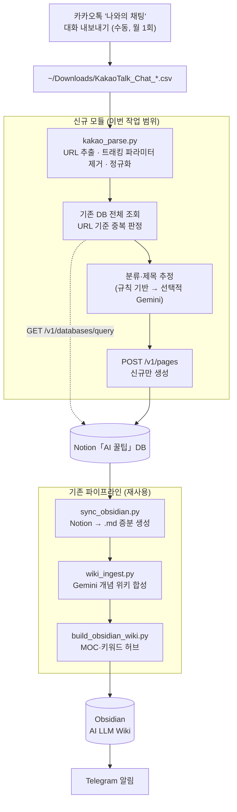

# 카카오톡 → Notion「AI 꿀팁」→ Obsidian LLM Wiki 연동 지침서

작성일: 2026-09-06 · 대상 세션: Claude Code / Cowork (프로젝트 루트에서 시작)
레포: `/Users/tycoonan/Documents/Claude/Projects/Youtube_Notion_Grap`

---

## 0. 배경 — 지금까지 확정된 사실

| 항목 | 값 |
|------|-----|
| Notion「AI 꿀팁」DB ID | `3bca3cbc5c7a804aa526cab1878a5c6c` |
| 뷰 URL | `https://app.notion.com/p/irichgreen/3bca3cbc5c7a804aa526cab1878a5c6c?v=ffd396c266c64060be29473f2fa8cc57` |
| 현재 행 수 | 98건 (2026-03-08 ~ 2026-09-06) |
| 카톡 export | `~/Downloads/KakaoTalk_Chat_안진훈_YYYY-MM-DD-*.csv` (수동 다운로드) |
| Obsidian Vault | `/Users/tycoonan/Documents/Obsidian/AI LLM Wiki/AI LLM Wiki` |

**이미 갖춰진 자산 (재사용할 것, 새로 만들지 말 것)**
- `.env`의 `NOTION_TOKEN` — 기존 통합 토큰. AI 꿀팁 DB도 이 토큰으로 붙인다.
- `sync_obsidian.py` — Notion → Obsidian 증분 동기화 + wiki_ingest 연동
- `wiki_ingest.py` / `wiki_config.py` — Gemini 기반 위키 합성 (일 230 RPD 제한)
- `build_obsidian_wiki.py` — MOC·키워드 허브 재구성

**해결된 이슈**
- 브라우저 CSV 병합은 macOS 네이티브 파일 선택창 때문에 자동화 불가 → API 방식으로 전환하는 것이 이 지침서의 목적
- 2026-09-06 CSV 병합이 2회 실행되어 15건이 중복 생성됨 → 15건 수동 삭제 완료 (휴지통에 보존)

---

## 1. 목표 파이프라인



**핵심 설계 판단**: 카톡 인제스트는 기존 YouTube 파이프라인과 **별도 진입점**이되,
Obsidian 이후 단계는 **완전히 공유**한다. 위키 합성 로직을 두 벌 만들지 않는다.

---

## 2. 사전 준비 — Notion API 연결 (1회, 약 5분)

### 2-1. 통합에 DB 공유

기존 `NOTION_TOKEN`이 이미 있으므로 **새 통합을 만들 필요가 없다.**
「AI 꿀팁」DB 페이지에서:

```
··· → 연결 (Connections) → 기존 통합 선택 → 확인
```

권한은 **읽기 + 삽입(Insert)** 이 모두 필요하다. 읽기만 있으면 중복 조회는 되지만 생성이 401로 막힌다.

### 2-2. 연결 검증 (반드시 먼저 돌릴 것)

```bash
cd /Users/tycoonan/Documents/Claude/Projects/Youtube_Notion_Grap
node -e "
require('dotenv').config();
fetch('https://api.notion.com/v1/databases/3bca3cbc5c7a804aa526cab1878a5c6c',{
  headers:{Authorization:'Bearer '+process.env.NOTION_TOKEN,'Notion-Version':'2022-06-28'}
}).then(r=>r.json()).then(j=>{
  if(j.object==='error') return console.error('❌', j.code, j.message);
  console.log('✅ 연결됨:', j.title?.[0]?.plain_text);
  console.log('속성 타입:'); 
  for(const [k,v] of Object.entries(j.properties)) console.log('  ', k, '→', v.type);
});"
```

**이 출력의 속성 타입을 그대로 코드에 반영한다. 추측 금지.**
특히 `출처`는 URL 타입인지 rich_text인지 육안으로 구분이 안 되며, 틀리면 400이 난다.

### 2-3. .env 추가

```env
NOTION_TIPS_DB_ID=3bca3cbc5c7a804aa526cab1878a5c6c
KAKAO_EXPORT_DIR=/Users/tycoonan/Downloads
```

> `NOTION_DB_ID`(YouTube용)와 **다른 변수명**을 쓸 것. 재사용하면 YouTube 파이프라인이 엉뚱한 DB에 쓴다.

---

## 3. 신규 파일 (제안)

| 파일 | 역할 |
|------|------|
| `kakao_ingest.py` | 진입점. CSV 파싱 → 중복 판정 → Notion 생성 → 결과 리포트 |
| `lib/kakao_parse.py` | URL 추출·정규화 전용. 순수 함수로 유지(테스트 가능하게) |
| `lib/tips_notion.py` | 「AI 꿀팁」DB 전용 조회/생성 래퍼 |
| `docs/tasks/2026-09-06-kakao-tips-ingest.md` | 이 문서 |

### URL 정규화 규칙 (검증 완료 — 그대로 이식할 것)

제거 대상 쿼리 파라미터:
```
fbclid utm_source utm_medium utm_campaign utm_content utm_term
pvs si mcp_token _phid _phsrc source shareKey navType pli usp gclid igshid
```

이 규칙 덕분에 `?source=copy_link`만 다른 동일 링크가 중복으로 잡히지 않는다.
실제로 2026-08-26 재저장분 1건이 이 규칙으로 걸러졌다.

### 제목 추정

노션 공유 링크는 슬러그에서 한글이 잘려나가므로 (`.../AI-27-3255...`) 제목 복원이 안 된다.
1차는 슬러그 기반 추정 + `상태: 미확인` / `메모: 원문 확인 필요`로 넣고,
2차로 Gemini에 URL을 주어 제목을 채우는 것은 **선택 사항**이다.
현재 98건 중 약 35건이 제목 미확인 상태다.

---

## 4. 기존 코드와 충돌하는 지점 — 반드시 먼저 확인

### 4-1. `sync_obsidian.py`의 고아 파일 격리 (최우선 위험)

`quarantine_orphans()`는 **`video_url` 프론트매터가 있고 토픽 폴더 안에 있는 노트만** 대상으로 한다.
따라서 꿀팁 노트에는:

- 프론트매터 키를 **`link_url`** 로 쓴다 (`video_url` 절대 금지)
- 별도 폴더 **`AI 꿀팁/`** 아래에 둔다

이 두 가지를 지키면 기존 격리 로직이 꿀팁 노트를 건드리지 않는다.
**만약 격리 로직을 꿀팁까지 확장하려 한다면, CLAUDE.md에 명시된 3중 안전장치를 그대로 복제해야 한다. 완화 금지.**
(2026-08-21에 435개가 격리된 이력이 있다. `_trash/20260821_172922/`는 삭제 금지.)

### 4-2. `wiki_ingest.py`가 새 폴더를 순회하는지 확인

Vault 전체를 걷는지, 토픽 폴더만 걷는지 코드를 읽고 판단할 것.
후자라면 `AI 꿀팁/`을 대상에 추가해야 한다.
**일 230 RPD 제한이 있으므로**, 98건을 한 번에 밀어넣지 말고 `--limit`으로 나눠 돌린다.

### 4-3. 한글 NFC 정규화

macOS는 파일명을 NFD로 저장한다. 카테고리명(`모델/LLM` 등)을 폴더명으로 쓸 경우 반드시 `.normalize('NFC')`.
참고로 `모델/LLM`에는 슬래시가 들어 있어 **폴더명으로 쓰면 경로가 깨진다.** `모델-LLM`으로 치환할 것.

### 4-4. Notion API 제약

- Rate limit: 평균 3 req/sec → 생성 루프에 **350ms sleep** 필수
- `rich_text` 항목당 2000자, 배열 100개 상한
- `Notion-Version: 2022-06-28` 헤더 고정 (기존 코드와 동일 버전 유지)

### 4-5. 보안 원칙 (CLAUDE.md 1순위)

401/403 감지 시 **연쇄 요청 중단 후 즉시 종료**. 재시도는 지수 백오프.
이 프로젝트의 기존 규칙이며 카톡 모듈도 예외가 아니다.

---

## 5. 작업 순서

1. §2-2 연결 검증 스크립트 실행 → 속성 타입 확보
2. `lib/kakao_parse.py` 작성 + 기존 CSV로 단위 검증 (신규 0건이 나와야 정상)
3. `lib/tips_notion.py` 조회 함수만 먼저 → 98건 전량 로드 확인
4. `kakao_ingest.py` **`--dry-run` 먼저**. 생성될 행을 표로 출력만 한다
5. `--limit=3`으로 실제 생성 → Notion에서 육안 확인
6. 전량 실행
7. `sync_obsidian.py` 확장 → `--orphans-dry-run`으로 부작용 없음 확인
8. `wiki_ingest.py --limit=20`으로 시험 → 이상 없으면 전량

> **4번(dry-run)을 건너뛰지 말 것.** 오늘 중복 15건이 발생한 원인이 정확히 "미리보기 없이 실행"이었다.

---

## 6. 검증 체크리스트

- [ ] 기존 CSV 재실행 시 신규 **0건** (멱등성)
- [ ] `?source=copy_link` 같은 파라미터 차이가 중복으로 잡히지 않음
- [ ] 같은 스크립트를 연속 2회 돌려도 행이 늘지 않음 ← **오늘 사고의 재발 방지 조건**
- [ ] Notion 행 수 = 98 + 신규 건수
- [ ] `sync_obsidian.py --orphans-dry-run` 결과에 꿀팁 노트가 **없음**
- [ ] Vault `AI 꿀팁/` 폴더에 .md 생성, 프론트매터 키가 `link_url`
- [ ] `.gitignore`에 새 상태 파일 추가 후 `git check-ignore -q <파일>` 확인

---

## 7. 새 세션 시작 프롬프트 (복사해서 사용)

```
Youtube_Notion_Grap 프로젝트에서 카카오톡 → Notion「AI 꿀팁」→ Obsidian 연동을 진행한다.

먼저 읽을 것:
- CLAUDE.md (보안 원칙, Notion/NFC 제약, 고아 격리 안전장치)
- docs/tasks/2026-09-06-kakao-tips-ingest.md (이 작업의 지침서)

지침서 §2-2의 연결 검증 스크립트부터 실행해서 속성 타입을 확보한 뒤,
§5 작업 순서대로 진행해줘. 4번 dry-run은 반드시 거칠 것.
```

---

## 부록 — 오늘(2026-09-06) 처리 내역

- 카톡 CSV에서 2026-08 이후 링크 30건 추출 → 기존 DB 대조 → 신규 15건 식별
- CSV 병합이 2회 실행되어 30행 생성 → 중복 15행 삭제 (휴지통 보존)
- 최종 98행

신규 15건 중 우선순위 상: `ADU Kimi 가이드`, `GPT-6 활용 100선`,
`Claude Design TOP 5 스킬`, `Claude Desktop + Ollama 로컬 연동`, `MarkItDown`
